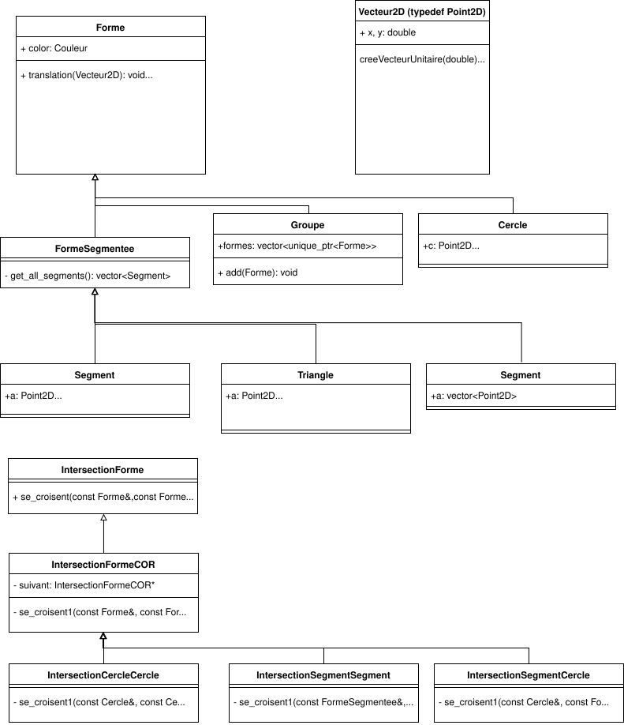

# Rapport de projet de Pierre-Emmanuel Devin et Thomas Moretti.

# Protocole client-serveur.

### Format
Chaque requête doit être envoyée sur une unique ligne. Chaque donnée d'une requête doit être séparée des autres par un `;`.

### Mise à jour de la zone monde
Définit la zone du monde qui sera affichée par le serveur en donnant une de ses diagonales. Cette donnée doit absolument
être envoyée avant n'importe quelle requête de dessin. Elle peut être modifiée à n'importe quel moment de l'execution.

`worldzone;x1;y1;x2;y2`

- x1, y1 (réels) : les coordonnées du premier point d'une diagonale de la zone
- x2, y2 (réels) : les coordonnées du deuxième point d'une diagonale de la zone

## Dessin

### Segment
Dessine un segment allant d'un point 1 à un point 2 avec une couleur donnée.

`line;x1;y1;x2;y2;color`

- x1, y1 (réels) : les coordonnées du point 1
- x2, y2 (réels) : les coordonnées du point 2
- color (string) : la couleur voulue (voir [Couleurs](#couleurs))

### Polygone
Dessine un polygone avec des points, une couleur et un paramètre `fill` donnés.

`polygon;n;x1;y1;x2;y2;...;xn;yn;color;fill`

- n (entier) : le nombre de points du polygone
- xn, yn (réels) : les coordonnées du point n
- color (string) : la couleur voulue (voir [Couleurs](#couleurs))
- fill (booléen) : *true* si la forme doit être remplie, *false* si elle doit être vide

### Cercle
Dessine un cercle avec un centre, un rayon, une couleur et un paramètre `fill` donnés.

`circle;xc;yc;radius;color;fill`

- xc, yc (réels) : les coordonnées du centre du cercle
- radius (réel) : le rayon du cercle
- color (string) : la couleur voulue (voir [Couleurs](#couleurs))
- fill (booléen) : *true* si la forme doit être remplie, *false* si elle doit être vide

### Nettoyage
Vide entièrement la zone de dessin.

`clear`

## Couleurs
Liste des couleurs prises en charge :

- `black`
- `blue`
- `red`
- `green`
- `yellow`
- `cyan`

A noter que si une couleur non prise en charge est fournie dans une requête alors la couleur par défaut sera `black`.

# Serialisation-déserialisation.

### Segment

```
segment
color
x1 y1
x2 y2
```

- color: une des couleurs prise en charge
- x1 y1: coordonnées du point d'une des extrémité du segment
- x2 y2: coordonnées du point de l'autre extrémité du segment

### Polygone:

```
polygone
color
n
x1 y1
...
xn yn
```
- color: une des couleurs prise en charge
- n: le nombre de points dans le polygone
- x1 y1...xn yn: les coordonées de chaques points du polygone

### Triangle:

```
triangle
color
x1 y1
x2 y2
x3 y3
```
- color: une des couleurs prise en charge
- x1 y1...x3 y3 les coordonnées de chaques points du triangle 

### Cercle

```
cercle
color
cx cy
r
```
- color: une des couleurs prise en charge
- cx cy: les coordonnées du centre du cercle
- r: le rayon du cercle.

### Groupe

```
groupe
color
n
```
- color: une des couleurs prise en charge
- n: Les n prochaines formes font partie du groupe

# UML

## Diagrammes du client CPP 


Groupe utilise le Design-Pattern Composite.
IntersectionForme utilise le Design-Pattern Chain of Responsibility.


ClientTCP utilise le Design-Pattern Singleton.


SauvegardeurTxt utilise le Design-Pattern visitor.
AnalyseurTxt utilise le Design-Pattern Chain of Responsibility.

## Diagrammes du serveur Java


Utilisation de la même représentation des vecteurs qu'en C++.


Parser utilise le Design-Pattern Chain of Responsibility.
